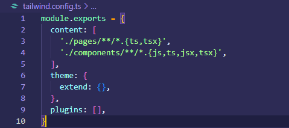
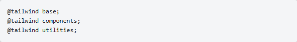
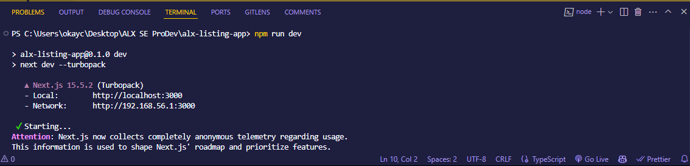
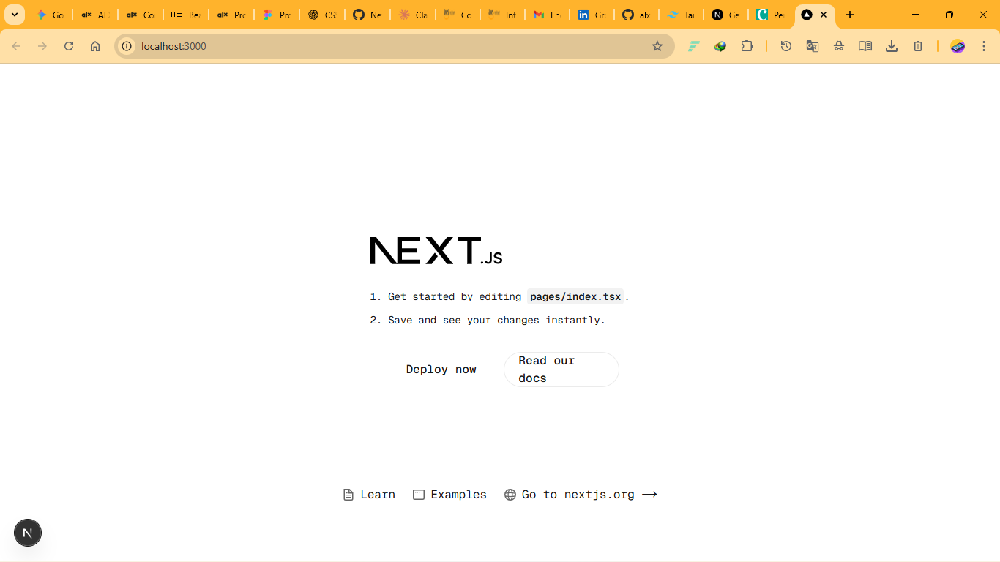

# 🏡 ALX Listing App

The **ALX Listing App** project aims to scaffold and lay the foundational structure for a modern **Airbnb clone**.  
This milestone focuses on setting up a **well-organized and scalable codebase** using **Next.js, TypeScript, TailwindCSS, and ESLint**.  

By establishing a clean folder structure, reusable components, and adhering to best practices, the project ensures a **solid starting point** for building a dynamic, responsive, and user-friendly property listing page.

---

## 📂 Folder Structure

- **components/** → Contains all reusable UI components  
  - `common/Card.tsx` → Reusable Card component for property listings  
  - `common/Button.tsx` → Reusable Button component for actions  

- **constants/** → Stores reusable data/constants (API URLs, config, UI text)  
  - `index.ts`

- **interfaces/** → Defines TypeScript interfaces for type safety  
  - `index.ts`

- **pages/** → Next.js pages (routing handled automatically)  
  - `index.tsx`

- **public/** → Public assets (served statically at `/`)  
  - `assets/` → Images, SVGs, icons, etc.  

- **styles/** → Global styles and TailwindCSS setup  
  - `globals.css`

- **tailwind.config.js** → TailwindCSS configuration file  
- **tsconfig.json** → TypeScript configuration  
- **package.json** → Dependencies and scripts  
- **README.md** → Project documentation
   
---

# To set up the project
- Open up your favourite terminal and cd to the project folder;
  - Type in the command below in the terminal

  

- Create a tailwind.config.js file within the root project folder
  - Have in it the below configuration in it.

  

- Import tailwind components, base and utility inside your styles/global.css files

  

- Start your server with the command npm run dev in your terminal.
  - You should have the same output above. Press CTRL key and click on the local url to open your project in the browser.

  

- Below should be your output in the browser 👇🏿👇🏿👇🏿

  

---

# Read more on how Install Tailwind CSS with Next.js
- Tailwindcss-documentaion
- NEXTjs-documentation
  
